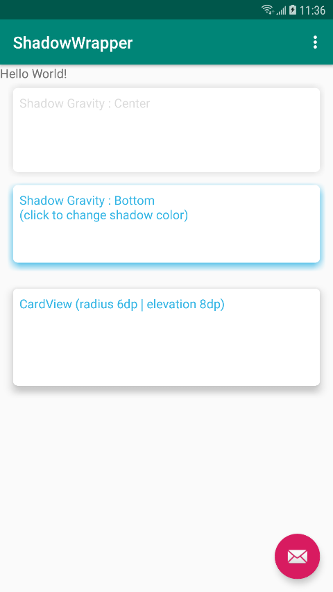

# ShadowWrapper

A wrapper for implementing View's shadow effect.

## [WIP]
Support setting View's shadow attributes (including its color and direction) easily. You could also check the supported attributes [here](https://github.com/rayworks/ShadowWrapper/blob/master/shadowlib/src/main/java/com/rayworks/shadowlib/RoundLinerLayoutNormal.kt#L98).

Inspired by the Medium article [Take control of view’s shadow — Android](https://medium.com/@ArmanSo/take-control-of-views-shadow-android-c6b35ba573e9).

## Import to your project

### Gradle

```groovy
repositories {
    ...
    maven { url 'https://jitpack.io' }
}

dependencies {
    implementation 'com.github.rayworks:ShadowWrapper:0.1.2'
}
```

## Credit
[Arman Soudi](https://twitter.com/ArmanSo)

## Screenshot

